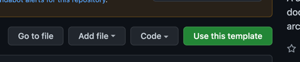
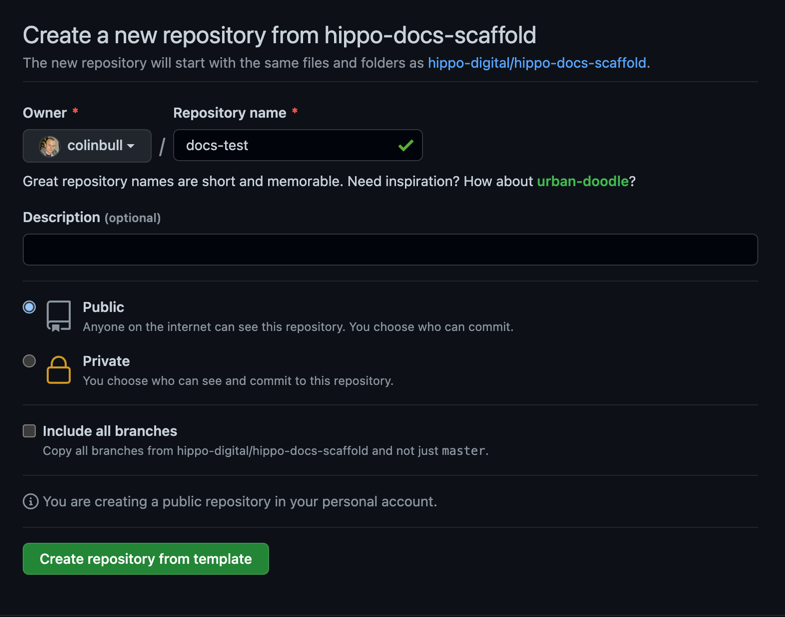

# Getting started

The current repository is a [template repository](https://docs.github.com/en/repositories/creating-and-managing-repositories/creating-a-repository-from-a-template) this means that is can't be used directly, instead you have to first make a clone of this repository. To do this click the use this template button 

You will then be asked to fill in the following form, you will need to provide a name for your new repository and also ensure that the target organisation is correct. 

Once the target repository has been created you can then 

Clone the repository to a local directory. Since the repository above was created to an owner called `colinbull` with a name of `docs-test` to clone this repository would use the following command 

    git clone https://github.com/colinbull/docs-test.git

by default git will clone to a directory that matches the name of the repository in this case `docs-test` we now need to change to this directory using 

    cd docs-test

Once you have navigated to the directory you can then run

    npm install

and then

    npm run start 

this will start the development web server running on port 8000. So you can open a browser and navigate to [http://localhost:8000](http://localhost:8000) you should 
